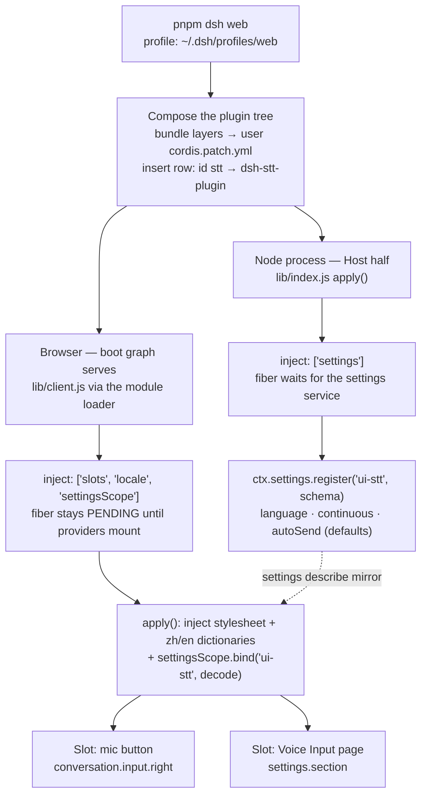
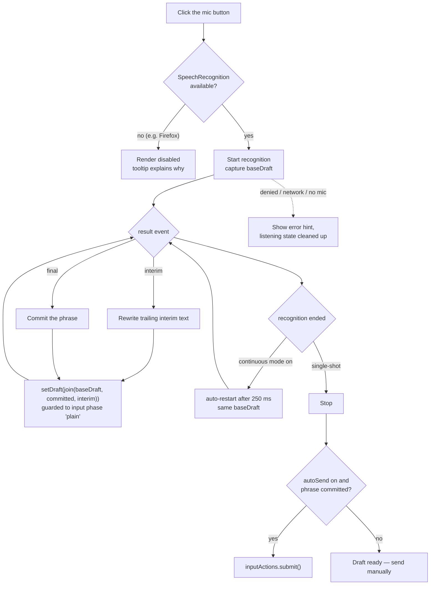

# dsh-stt-plugin

[English](./README.md) | [简体中文](./README.zh-CN.md)

A speech-to-text (voice input) plugin for [DeepSeek Harness](https://github.com/deepseek-ai/deepseek-harness).

It adds a **microphone toggle** to the conversation composer tool row (beside the model selector and the submit button) that dictates into the message draft via the browser's Web Speech API, plus a **Voice Input** page in the settings dialog for recognition language, continuous dictation, and auto-send. All recognition runs in the browser — only the recognized text enters the conversation.

## Features

- 🎙 **Mic toggle in the composer** — click to start/stop; recognized text (interim results included) is written into the draft in real time.
- ⚙️ **Voice Input settings page** — recognition language, continuous dictation, and auto-send; preferences persist through the DSH settings service (`ui-stt` namespace).
- 📴 **Auto-send** — off by default; when enabled (single-shot mode), the message submits automatically as soon as a phrase finishes.
- 🔁 **Continuous dictation** — keep the microphone open until you toggle it off; phrases accumulate in the draft.
- 🔒 **Local-only audio** — no audio ever reaches the Host or the model provider.
- 🧩 **Clean Cordis lifecycle** — slots, styles, locale dictionaries, and the settings scope are all Fiber-owned and removed on unload.

## Requirements

| Requirement | Notes |
| --- | --- |
| DeepSeek Harness | run-from-source (`pnpm dsh web`) or a deployed bundle with profile support |
| Node.js ≥ 18 / pnpm ≥ 8 | for building and installing the plugin |
| Browser | Chrome / Edge ✅ full support · Safari ⚠️ partial · Firefox ❌ unsupported (button renders disabled) |
| Microphone permission | the browser asks on first use |

## Install

### Option 1 — install from the npm registry (recommended; no GitHub access needed)

```sh
# installs the package into the profile and adds the bundle layer
dsh plugin --profile web add dsh-stt-plugin

# boot (or reboot) the harness — `web` is the built-in alias for `--profile web`
dsh web
```

Notes:

- This is the most reliable path: a registry fetch never touches GitHub, so it works on networks where GitHub is unreachable. On mainland-China networks, point pnpm at a registry mirror first (any directory):

  ```sh
  pnpm config set registry https://registry.npmmirror.com
  ```

- The repository ships **prebuilt `lib/` artifacts** — installing this package runs **no build scripts**, so pnpm ≥ 10 build-script approvals are never needed for it. (Build tooling lives in devDependencies and is only used inside the plugin checkout.)
- To install a pinned version, use `dsh-stt-plugin@0.1.0`.

### Option 2 — install from GitHub (requires GitHub connectivity)

```sh
dsh plugin --profile web add github:zemanzhang809/dsh-stt-plugin
```

> **Symptom watch:** if the install stalls at `Progress: resolved …` and then fails with `git ls-remote … Could not connect to server`, your machine cannot reach github.com — that is a network problem, not a plugin problem. Use Option 1 or Option 3, or route git through a proxy (`git config --global http.proxy http://127.0.0.1:<port>`).

Notes:

- If you previously installed the plugin manually (Option 3), remove its `insert` row from the profile's `cordis.patch.yml` first: installed this way the package joins the bundle layers and contributes the row itself — a duplicate `stt` entry fails composition.
- To install a pinned version, use `github:zemanzhang809/dsh-stt-plugin#v0.1.0`.

### Option 3 — install from a local checkout (development / offline)

```sh
# 1. prepare the plugin checkout
git clone https://github.com/zemanzhang809/dsh-stt-plugin.git
cd dsh-stt-plugin
pnpm install && pnpm build   # lib/ is also committed; rebuild only after editing src/

# 2. link it into the target profile's node_modules
cd ~/.dsh/profiles/web
pnpm add /absolute/path/to/dsh-stt-plugin
```

Then add the plugin row to the profile's user patch layer (`cordis.patch.yml`) — **new rows must use the `insert` form**:

```yaml
- insert:
    - id: stt
      name: dsh-stt-plugin
- # ...any existing id-targeted overrides stay as they are
```

With `patchReload: "live"` in the profile, saving the file hot-reloads the composition; otherwise restart the harness.

Because the package is linked (`link:`), later development is just: edit `src/` → `pnpm build` → refresh the browser (host-half changes need a restart).

### Option 4 — verify the installation

```sh
# composition-level check, no boot needed: the output must contain
#   - id: stt
#     name: dsh-stt-plugin
dsh --profile web --dump-config
```

In the browser:

1. Open the settings dialog → the left navigation shows **Voice Input** (independent of any session — the fastest signal).
2. Open (or start) a session → the composer tool row shows the **microphone button** (left of the model selector).

## Usage

1. Open a session so the composer is live.
2. Click the mic button and speak. Recognized text is appended to the draft (a space joins the draft and each phrase; interim results are rewritten live).
3. Click the mic again to stop. With **auto-send** enabled in single-shot mode, the message submits automatically when a phrase finishes; otherwise send as usual.

### Settings reference

Open **Settings → Voice Input**:

| Setting | Default | Meaning |
| --- | --- | --- |
| Recognition language | `auto` | `auto` follows the browser locale, or pick a BCP-47 code (zh-CN, en-US, ja-JP, de-DE, fr-FR, es-ES, ru-RU, …). |
| Continuous dictation | off | Keep the microphone open until you click the mic button again; phrases accumulate in the draft. |
| Auto-send after recognition | off | Single-shot mode only: submit the message as soon as a phrase finishes. |

Preferences persist in the DSH settings store and survive refresh and restart. If the settings service is unavailable in your composition, the page shows a hint and the mic button falls back to defaults.

## Button placement note

The composer tool row offers two **additive slot lists** (`conversation.input.left` / `conversation.input.right`); this plugin registers into `conversation.input.right`, whose entries render at the right end of the row, directly before the model selector — the closest zero-risk position to "left of the send button, right of the model selector". There is no additive seat *between* the model selector and the submit button; occupying that exact gap would require replacing the whole shipped composer (`conversation.composer.bar`, a single slot), shadowing the product UI and every child slot it declares. If upstream ships a finer-grained seat there, migrating is a one-line change in [`src/client/index.tsx`](./src/client/index.tsx).

## How it works

Two flows make up the plugin: how it gets composed into the running harness, and what happens while you dictate.

### 1. Composition & loading



The Host and Client halves never talk to each other directly: the Host only registers the settings namespace, and the Client reads it back through the settings scope (`bind` + `describe` mirror, dotted edge). Speech never leaves the browser — only recognized text enters the draft.

### 2. Dictation runtime



Everything on the right side of the first diagram runs inside one page; `setDraft` / `submit` are the standard session input actions every session-scoped slot receives, so the plugin never touches product DOM.

## Architecture

```
dsh-stt-plugin/
├── cordis.patch.yml          # composition layer: inserts the plugin row
├── package.json              # dsh.bundle.patch + dsh.client (web) manifest
├── scripts/
│   ├── build.mjs             # esbuild: lib/index.js (node ESM) + lib/client.js (browser)
│   └── smoke.mjs             # artifact + render-level smoke tests
├── docs/
│   └── dev-pitfalls.zh-CN.md # development post-mortem: pitfalls & debugging playbook
└── src/
    ├── host.ts               # registers the ui-stt settings namespace (Schemastery schema)
    ├── shared/languages.ts   # language list shared by schema and UI
    └── client/
        ├── index.tsx         # apply(): slots, styles, locale, settings scope
        ├── mic-button.tsx    # Web Speech API + inputActions.setDraft/submit
        ├── settings-section.tsx  # Voice Input settings page
        ├── speech.ts         # Web Speech API typings + helpers
        ├── locales.ts        # zh / en dictionaries
        └── styles.ts         # plugin stylesheet (theme tokens)
```

- **Host half** — one contribution: `ctx.settings.register('ui-stt', …)` so the browser can bind a durable scope. No audio, no networking.
- **Client half** — registers `conversation.input.right` (mic button) and `settings.section` (Voice Input page). Draft writes go through the standard session input actions (`setDraft` / `submit`) that every session-scope slot receives; no product DOM is touched.
- **Build contract** — `lib/client.js` is a classic script wrapping the bundle in `window.__ModuleLoader__.load({ id, factory })` (the DSH client module protocol); `react` / `react/jsx-runtime` stay external and resolve from the shell's module table.

## Development

```sh
pnpm install
pnpm check   # tsc --noEmit
pnpm build   # emit lib/
pnpm test    # smoke-test both artifacts, incl. rendering both slot
             # components against simulated slot props (react-dom/server)
```

The test suite renders both UI components in Node with `react-dom/server` against the props the slot renderer assembles, so render crashes surface in CI instead of silently blanking the UI.

More development notes — composition pitfalls, the client runtime contracts this plugin relies on, and the debugging playbook — live in [docs/dev-pitfalls.zh-CN.md](./docs/dev-pitfalls.zh-CN.md).

## License

[MIT](./LICENSE)
