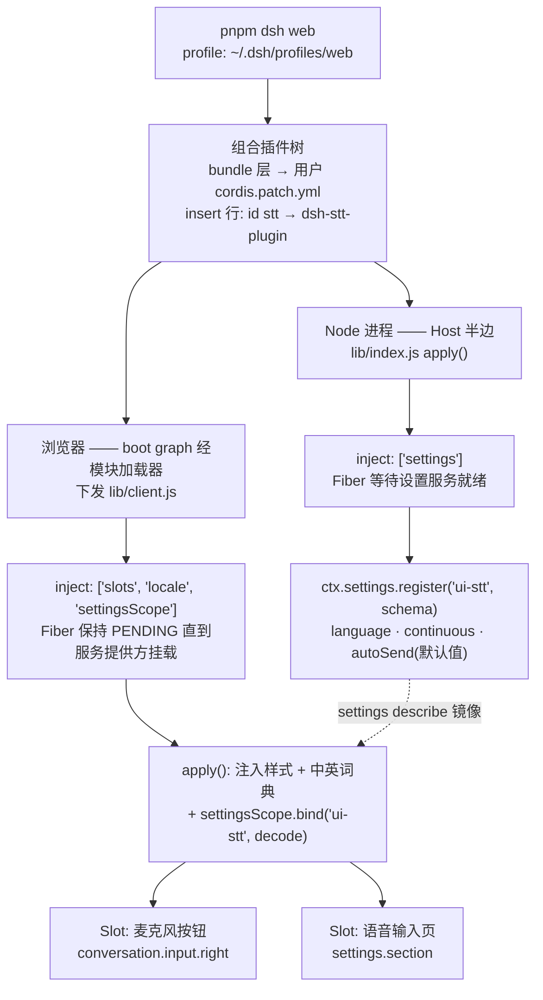
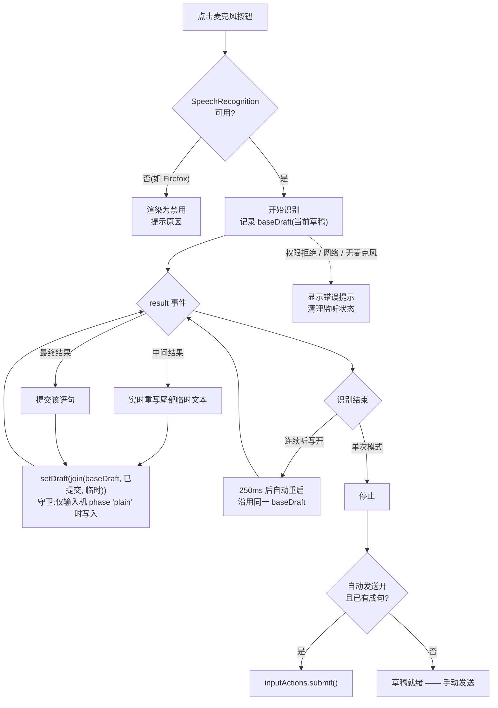

# dsh-stt-plugin

[English](./README.md) | [简体中文](./README.zh-CN.md)

[DeepSeek Harness](https://github.com/deepseek-ai/deepseek-harness) 的语音输入(STT)插件。

在会话输入框工具行(模型选择器与发送按钮一侧)添加**麦克风开关**,基于浏览器 Web Speech API 把语音实时转写进消息草稿;并在设置弹框中新增**「语音输入」**页面,可配置识别语言、连续听写与自动发送。识别完全在浏览器端完成,进入会话的只有识别出的文本。

## 功能特性

- 🎙 **输入框麦克风按钮** — 点击开始/停止;识别文本(含中间结果)实时写入草稿。
- ⚙️ **「语音输入」设置页** — 识别语言、连续听写、自动发送;配置通过 DSH 设置服务(`ui-stt` 命名空间)持久化。
- 📴 **自动发送** — 默认关闭;开启后(单次模式)一句话识别结束自动提交消息。
- 🔁 **连续听写** — 开启后麦克风持续工作直到再次点击停止,语句持续累加进草稿。
- 🔒 **音频不出浏览器** — Host 与模型提供方都不接触音频。
- 🧩 **干净的 Cordis 生命周期** — Slot、样式、词典、设置作用域全部挂在 Fiber 上,卸载即清理。

## 环境要求

| 要求 | 说明 |
| --- | --- |
| DeepSeek Harness | 源码运行(`pnpm dsh web`)或支持 profile 的部署包 |
| Node.js ≥ 18 / pnpm ≥ 8 | 构建与安装插件所需 |
| 浏览器 | Chrome / Edge ✅ 完整支持 · Safari ⚠️ 部分 · Firefox ❌ 不支持(按钮显示为禁用) |
| 麦克风权限 | 首次点击时浏览器会弹窗询问 |

## 安装

### 方式一:从 npm registry 安装(推荐;不需要能访问 GitHub)

```sh
# 把包安装进 profile 的 node_modules,并注册 bundle 层
dsh plugin --profile web add dsh-stt-plugin

# 启动(或重启)Harness —— `web` 是 `--profile web` 的内置别名
dsh web
```

说明:

- 这是最稳的路径:registry 拉取完全不经过 GitHub,在访问不了 GitHub 的网络下也能装。国内网络建议先把 pnpm 指到 registry 镜像(任意目录执行一次即可):

  ```sh
  pnpm config set registry https://registry.npmmirror.com
  ```

- 仓库**直接提交预构建的 `lib/` 产物**,且**零运行时依赖**(schemastery 已打包进产物)——安装本包**不运行任何构建脚本**、**不拉取任何传递依赖**,pnpm ≥ 10 的构建脚本审批与"新发布包放行时长"类供应链策略对本包均不适用(构建工具只放在 devDependencies,供插件仓库内开发使用)。
- 需要锁定版本时使用 `dsh-stt-plugin@0.1.0`。

### 方式二:从 GitHub 安装(要求能访问 GitHub)

```sh
dsh plugin --profile web add github:zemanzhang809/dsh-stt-plugin
```

> **症状对照**:安装停在 `Progress: resolved …` 随后报 `git ls-remote … Could not connect to server`,说明这台机器连不上 github.com——是网络问题,不是插件问题。改用方式一或方式三,或让 git 走代理(`git config --global http.proxy http://127.0.0.1:<端口>`)。
>
> 另一种失败形态是 `ERR_PNPM_MINIMUM_RELEASE_AGE_VIOLATION`,指向一个你从没听过的包(如 `style-mod`):任何 `pnpm add` 都会重解析整个 profile,某个**其他**包的传递依赖刚发布了新版本,触发了 pnpm 默认的 24 小时放行策略。在 **profile 的** `pnpm-workspace.yaml` 里把该包钉回上一个可用版本后重试:
>
> ```yaml
> overrides:
>   style-mod: 4.1.3
> ```

说明:

- 如果之前用方式三手工装过,先把它的 `insert` 行从 profile 的 `cordis.patch.yml` 里删掉:本方式下包会作为 bundle 层自带该行,重复的 `stt` 条目会导致组合失败。
- 需要锁定版本时使用 `github:zemanzhang809/dsh-stt-plugin#v0.1.0`。

### 方式三:从本地源码安装(开发 / 离线)

```sh
# 1. 准备插件检出
git clone https://github.com/zemanzhang809/dsh-stt-plugin.git
cd dsh-stt-plugin
pnpm install && pnpm build   # lib/ 已随仓库提交;改过 src/ 才需要重新构建

# 2. 链接进目标 profile 的 node_modules
cd ~/.dsh/profiles/web
pnpm add /绝对路径/dsh-stt-plugin
```

然后在 profile 的用户 patch 层(`cordis.patch.yml`)加入插件行——**新插件必须用 `insert` 形式**:

```yaml
- insert:
    - id: stt
      name: dsh-stt-plugin
- # 已有的按 id 覆盖条目保持原样
```

profile 为 `patchReload: "live"` 时保存文件即热重组;否则重启 Harness。

包以 `link:` 方式链接,后续开发迭代只需:改 `src/` → `pnpm build` → 刷新浏览器(Host 侧改动需要重启实例)。

### 方式四:验证安装是否生效

```sh
# 组合层检查,无需启动实例;输出中应包含
#   - id: stt
#     name: dsh-stt-plugin
dsh --profile web --dump-config
```

浏览器中:

1. 打开设置弹框 → 左侧导航出现**「语音输入」**(不依赖会话,是最快的确认信号)。
2. 打开(或新建)一个会话 → 输入框工具行出现**麦克风按钮**(模型选择器左侧)。

## 使用

1. 打开一个会话,让输入框进入可用状态。
2. 点击麦克风按钮开始说话。识别文本追加进草稿(草稿与每句话之间以空格拼接,中间结果实时重写)。
3. 再次点击停止。单次模式下若开启**自动发送**,一句话识别结束即自动提交;否则照常手动发送。

### 设置项参考

打开 **设置 → 语音输入**:

| 设置项 | 默认值 | 说明 |
| --- | --- | --- |
| 识别语言 | `auto` | `auto` 跟随浏览器语言,或选择 BCP-47 代码(zh-CN、en-US、ja-JP、de-DE、fr-FR、es-ES、ru-RU 等)。 |
| 连续听写 | 关 | 开启后麦克风持续工作,直到再次点击麦克风按钮;语句持续累加进草稿。 |
| 识别完成后自动发送 | 关 | 仅单次模式生效:一句话识别结束后自动提交消息。 |

配置持久化在 DSH 设置存储中,刷新与重启后保持。若该存储当前不可写(组合中没有设置服务,或页面经非环回地址访问),设置页会自动改用本浏览器的本地存储——控件始终可操作,并有提示说明保存位置。

## 关于按钮位置

输入框工具行提供两个**可累加列表**(`conversation.input.left` / `conversation.input.right`);本插件注册在 `conversation.input.right`,其条目渲染在工具行右端、模型选择器紧左侧——这是"发送按钮左侧、模型选择器右侧"的最低风险近似位。产品在该间隙内没有可累加的座位,精确占据它需要整体替换常驻输入器(`conversation.composer.bar`,single 插槽),会同时遮蔽官方 UI 及其声明的全部子插槽,不建议。若上游未来提供更细粒度的座位,只需在 [`src/client/index.tsx`](./src/client/index.tsx) 改一行插槽名即可迁移。

## 实现原理

插件由两条流程构成:如何被组合进运行中的 Harness,以及听写时的运行时行为。

### 1. 组合与加载



Host 与 Client 两个半边**从不直接通信**:Host 只注册设置命名空间,Client 通过设置作用域(`bind` + `describe` 镜像,虚线边)读回配置。语音永不出浏览器——进入会话的只有识别出的文本。

### 2. 听写运行时



第一张图右侧的一切都运行在同一个页面内;`setDraft` / `submit` 是会话级 Slot 都会收到的标准输入动作面,插件不操作任何产品 DOM。

## 项目结构

```
dsh-stt-plugin/
├── cordis.patch.yml          # 组合层:插入插件行
├── package.json              # dsh.bundle.patch + dsh.client (web) manifest
├── scripts/
│   ├── build.mjs             # esbuild:lib/index.js(Node ESM)+ lib/client.js(浏览器)
│   └── smoke.mjs             # 产物 + 渲染级冒烟测试
├── docs/
│   └── dev-pitfalls.zh-CN.md # 开发实录:踩坑记录与调试手册
└── src/
    ├── host.ts               # 注册 ui-stt 设置命名空间(Schemastery schema)
    ├── shared/languages.ts   # Host schema 与 UI 共用的语言列表
    └── client/
        ├── index.tsx         # apply():Slot、样式、词典、设置作用域
        ├── mic-button.tsx    # Web Speech API + inputActions.setDraft/submit
        ├── settings-section.tsx  # 「语音输入」设置页
        ├── speech.ts         # Web Speech API 类型与工具函数
        ├── locales.ts        # zh / en 词典
        └── styles.ts         # 插件样式(引用主题令牌)
```

- **Host 半边** — 只做一件事:`ctx.settings.register('ui-stt', …)`,让浏览器端可以绑定持久化作用域。不接触音频,不发起网络请求。
- **Client 半边** — 注册 `conversation.input.right`(麦克风按钮)与 `settings.section`(语音输入页)。草稿写入走会话级 Slot 的标准输入动作面(`setDraft` / `submit`),不操作任何产品 DOM。
- **构建契约** — `lib/client.js` 是以 `window.__ModuleLoader__.load({ id, factory })` 包裹的经典脚本(DSH 客户端模块协议);`react` / `react/jsx-runtime` 保持 external,由外壳模块表提供。

## 开发

```sh
pnpm install
pnpm check   # tsc --noEmit
pnpm build   # 产出 lib/
pnpm test    # 双端产物冒烟测试,含用 react-dom/server 按模拟的
             # Slot props 真实渲染两个组件
```

测试套件会在 Node 里按渲染器实际传参的方式真实渲染两个 UI 组件,渲染崩溃会在 CI 中直接暴露,而不是让 UI 静默消失。

更多开发笔记——组合层的坑、本插件依赖的客户端运行时契约、调试手册——见 [docs/dev-pitfalls.zh-CN.md](./docs/dev-pitfalls.zh-CN.md)。

## 许可证

[MIT](./LICENSE)
